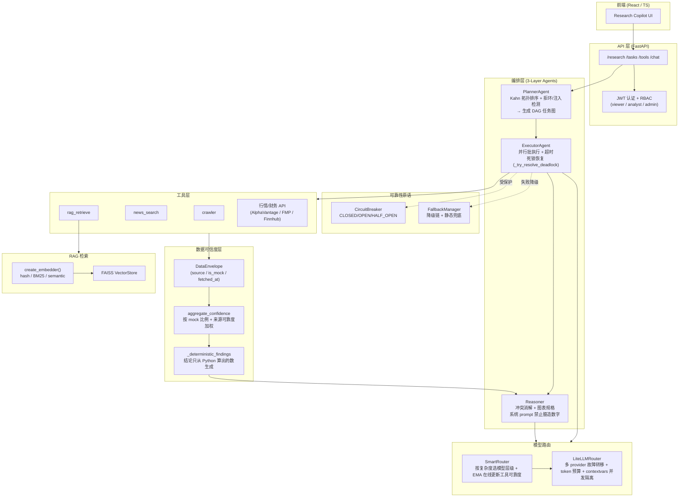

# 设计文档 (Architecture & Design Trade-offs)

本文说明 Smart Finance Agent 的整体架构、数据流，以及关键设计取舍背后的「为什么」。配套的可量化证据见 README 的「RAG 检索质量评测」与「编排可靠性」两节。

## 1. 系统架构

**一句话定位**：一个带 **数据溯源与置信度量化**、**多 Agent 编排（熔断 / 降级 / 死锁恢复）**、**RAG 检索质量经 Recall@k / MRR 评测验证** 的全栈金融分析系统。

## 2. 数据流（单股研究主线）

1. 用户发起研究请求 → API 鉴权（JWT + RBAC）。
2. `PlannerAgent` 把请求拆成子任务，用 Kahn 拓扑排序构建 DAG，拒绝成环 / 检测注入。
3. `ExecutorAgent` 按拓扑批次并行执行；每个工具调用受 `CircuitBreaker` 保护，失败时由 `FallbackManager` 沿降级链回退；上游失败导致停滞时 `_try_resolve_deadlock` 解锁可独立运行的下游。
4. 每个数据点被 `DataEnvelope` 包裹（source / is_mock / fetched_at）；`aggregate_confidence` 按 mock 比例 + 来源可靠度加权算出置信度。
5. 指标用纯 Python 计算，`_deterministic_findings` 只从算出的数生成结论。
6. `Reasoner` 做冲突消解 + 生成图表规格，系统 prompt 明令「不臆造数字」，LLM 只解读不编造。
7. 返回带置信度标注的报告。

## 3. 关键设计取舍

### 3.1 为什么是「确定性指标 + LLM 只解读」，而非端到端 LLM
- **问题**：直接让 LLM 输出金融数字会幻觉，且不可复现、不可审计。
- **取舍**：所有数字由 Python 计算，`DataEnvelope` 标注每个数据点来源与是否 mock，结论由 `_deterministic_findings` 从算出的数派生，LLM 仅负责自然语言解读。
- **代价**：表达灵活性下降，新增分析维度需要写计算代码而非靠 prompt。
- **收益**：可复现、可审计、可量化置信度——这是「带数据溯源的金融分析」与「套壳 LLM」的本质区别。

### 3.2 为什么用 LiteLLM 多 provider 路由
- **取舍**：`LiteLLMRouter` 统一封装多家 provider（mimo / deepseek 等），单例 + `get_instance()`，带 token 预算与 `contextvars` 并发隔离；`SmartRouter` 在其上按任务复杂度选模型层级，并用 EMA 在线更新各工具可靠度。
- **替代方案**：直连单一厂商 SDK —— 简单，但 provider 宕机即全挂，且无法按成本/复杂度分层。
- **代价**：多一层抽象、需维护 provider 配置。
- **收益**：provider 故障转移、成本-质量分层、并发请求互不串味的模型选择。

### 3.3 为什么用 FAISS + 可切换 Embedder
- **取舍**：`create_embedder()` 工厂按配置 `embedding.mode` 切换三种实现：`dev` → `HashEmbedder`（无依赖词法基线）/ `prod` → `BM25Embedder`（词法 BM25，默认）/ `semantic` → `SemanticEmbedder`（真语义，可选懒加载）。语义后端为**可选依赖**（sentence-transformers，缺失时回退到免-torch 的 model2vec），不进核心 requirements / CI。
- **替代方案**：直接上重型向量数据库或强制语义模型 —— 部署与 CI 成本高，且本项目语料规模（数十~数百文档）用不上。
- **代价**：语义检索需用户自行安装可选依赖。
- **收益**：CI 轻量、零强依赖即可跑；同时用评测集量化了三种 embedder 的差距（Recall@5：hash 0.56 → BM25 0.94 → semantic 1.00），让「选哪个」有数据支撑而非拍脑袋。

### 3.4 为什么把可靠性拆成三套独立原语
- **取舍**：`CircuitBreaker`（防止对宕机工具无谓重试）、`FallbackManager`（多级降级链 + 静态兜底，保证不返回空）、`_try_resolve_deadlock`（上游失败时解锁独立下游）各司其职、可独立测试。
- **替代方案**：在每个工具调用点写零散的 try/except —— 不可复用、不可量化、容易漏。
- **代价**：三套原语需要分别维护与测试。
- **收益**：可独立注入故障并量化（见 README「编排可靠性」：单点故障硬失败率恒为 0；级联故障 served 仍 100%；熔断短路 95% doomed 调用；死锁恢复 100%）。

### 3.5 为什么 Planner 用 Kahn 拓扑排序
- **取舍**：用 Kahn 算法做拓扑排序，天然检测环（成环即拒绝），并据此划分可并行的执行批次。
- **替代方案**：固定流水线顺序 —— 无法表达任务间真实依赖，也无法并行。
- **收益**：依赖正确性（拒环）+ 并行度（同批任务并发）+ 为死锁恢复提供清晰的图结构基础。

### 3.6 mock 兜底的定位
- `ALLOW_MOCK_DATA` 在外部 API 不可用 / 断网时提供带 `is_mock=True` 标注的降级数据，使 demo 在任何环境可跑。
- 关键点：mock **不会伪装成真实数据**——它在 `DataEnvelope` 里被显式标注，并通过 `aggregate_confidence` 拉低置信度，对用户透明。

## 4. 已知短板与边界（诚实声明）
- 金融分析目前是「指标计算 + LLM 解读 + 免责声明」，**没有回测验证的价值闭环**，不做预测/荐股。
- 语义检索为可选依赖，默认走 BM25 词法检索。
- 评测语料规模有限（数十文档），指标用于「相对比较 + 回归防退化」，不代表生产级召回。
