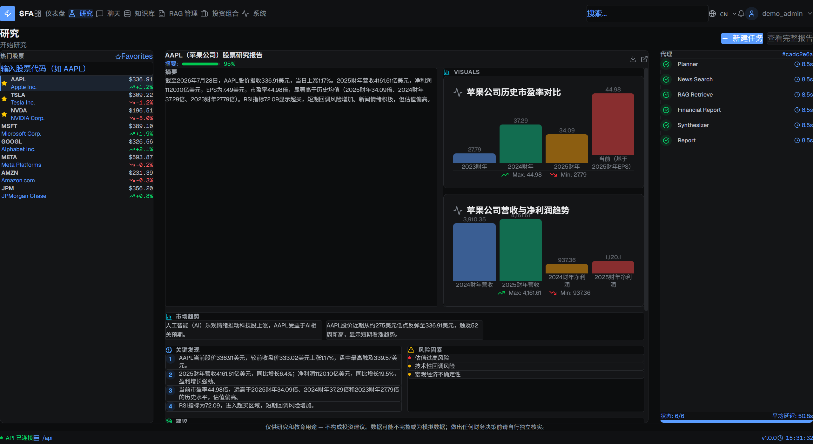
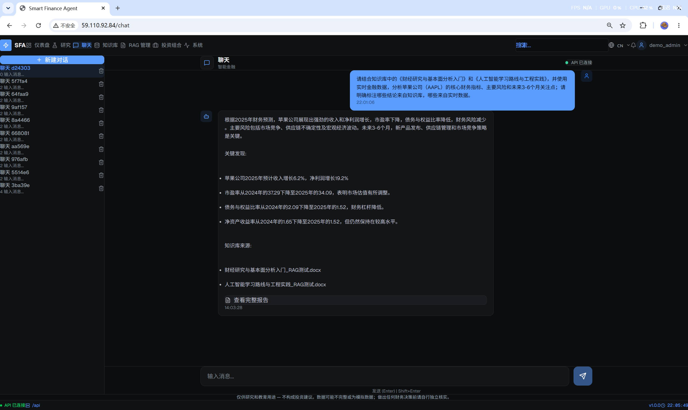
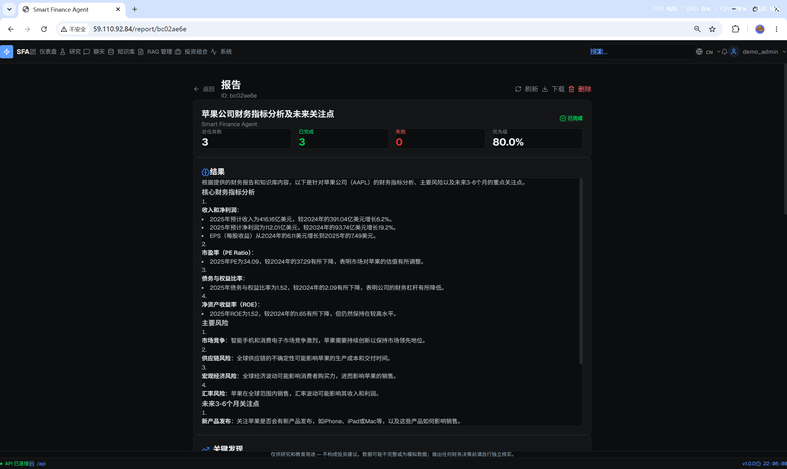
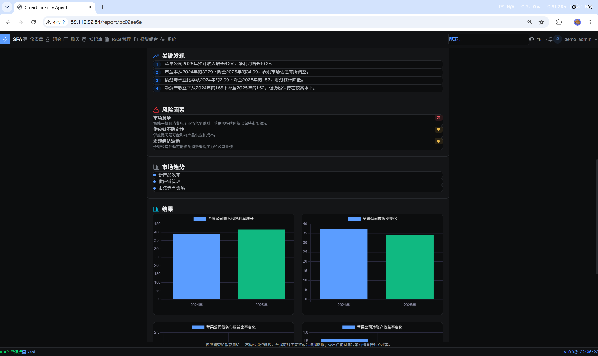
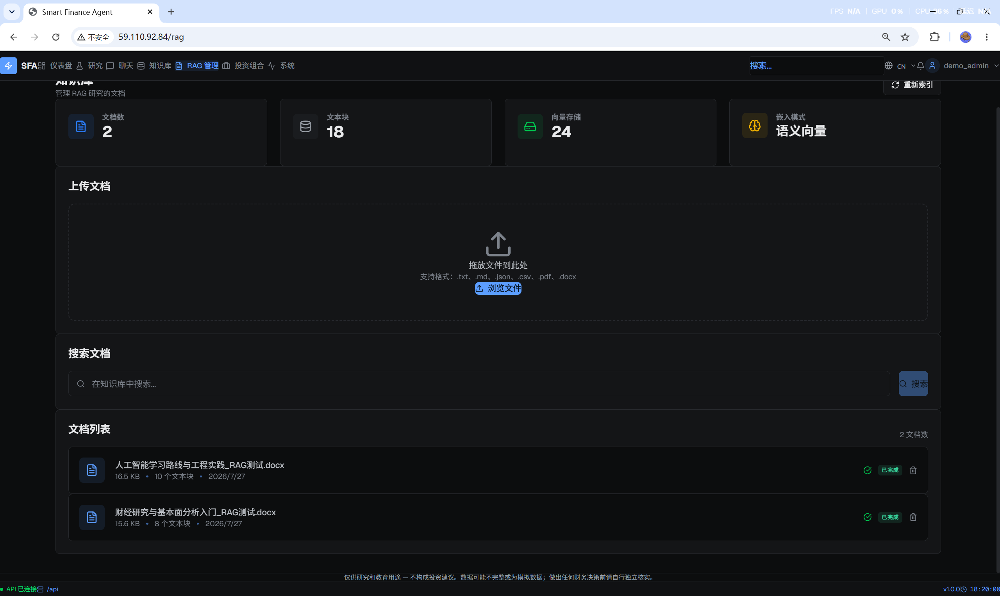
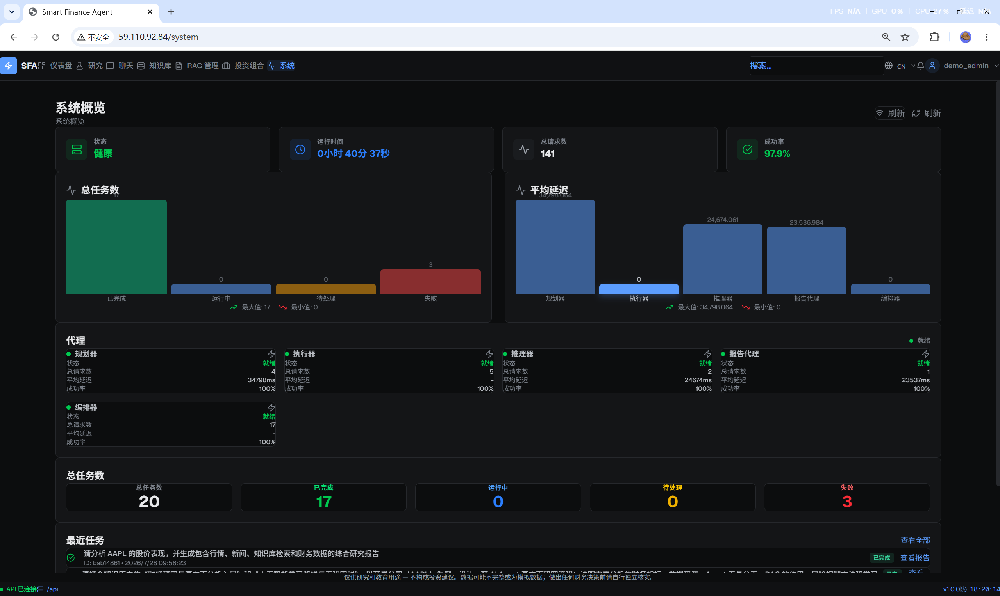
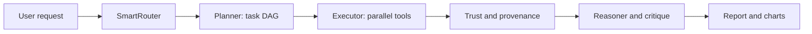

# Smart Finance Agent

[](https://github.com/irvy12321/smart-finance-agent/actions/workflows/ci.yml)
[](https://www.python.org/)
[](https://nodejs.org/)

输入一家公司或金融研究问题，系统自动检索行情、财报、新闻和知识库，执行多阶段分析，并生成带来源、置信度与风险提示的可追踪研究报告。

这不是只有聊天界面的 LLM 包装层。项目包含任务 DAG 规划与并行执行、工具调用、RAG、多模型路由、金融数据可信链、故障降级、评测体系和完整的 React 工作流界面。

[在线体验](http://59.110.92.84/) · [演示视频](docs/demo.mp4) · [架构设计](DESIGN.md) · [评测与可靠性证据](docs/EVALUATION.md) · [Docker 部署](docs/DOCKER.md) · [工作流设计](docs/WORKFLOW_VISUALIZATION.md)

演示账号：`demo_analyst` / `SfaAnalyst2026Demo39`（Analyst 权限，可体验研究、聊天、工具和知识库功能）。

> 在线演示已于 2026-08-03 实际验证可登录并进入研究工作台。站点使用 HTTP，演示密码仅用于该公开环境，请勿复用；行情与风险指标可能为带明确标识的模拟数据。本项目仅用于研究与教育，不构成投资建议。

## 产品演示

<p align="center">
  
</p>

一次研究请求会经过 Planner 生成任务 DAG、Executor 调用工具并行取数、Reasoner 综合分析与低置信度自我检查，最后由 Report Agent 生成结构化报告。前端同步展示各阶段状态和任务依赖。

<details>
<summary><strong>查看更多界面</strong></summary>

### 对话引用与报告入口

<p align="center">
  
</p>

### 结构化分析与图表

<p align="center">
  
</p>

<p align="center">
  
</p>

### RAG 知识库与系统监控

<p align="center">
  
</p>

<p align="center">
  
</p>

</details>

## 核心设计

### 1. 可执行的 Agent 编排

- `SmartRouter` 根据任务复杂度选择模型与规划粒度；路由模型通过 `ContextVar` 隔离，并在 `finally` 中恢复。
- `PlannerAgent` 输出带依赖关系的 `SubTask` DAG，清理悬空依赖并使用 Kahn 算法拒绝成环计划。
- `ExecutorAgent` 按拓扑批次使用 `asyncio.gather` 并行执行，只有成功的依赖结果会注入下游。
- `Reasoner` 在置信度低于 `0.6` 时触发一次结构化 critique/refine；失败时保留原结果。
- `ReportAgent` 将任务结果、推理、来源和风险组织为可持久化报告，`ChartRenderer` 只负责确定性绘图。



### 2. 金融数据可信链

金融数值遵循固定路径：

```text
外部 API / 工具结果
  -> Python 确定性指标计算
  -> DataEnvelope(source, is_mock, fetched_at, warning)
  -> 置信度聚合
  -> LLM 解释与报告
```

- SMA、EMA、RSI、涨跌幅和 PE 等指标由 Python 计算，数据不足返回 `None`。
- 工具结果统一携带 `source` 与 `is_mock`；模拟数据附带 `SIMULATED DATA - NOT FOR INVESTMENT`。
- `ALLOW_MOCK_DATA=false` 可关闭模拟数据兜底。
- 无外部数据的静态降级报告会添加免责声明，并把置信度上限限制为 `0.2`。
- LLM 只解释上下文中的金融数值，不承担指标计算。

### 3. 可靠性不是一句“自动降级”

- 每个工具独立维护 `CLOSED -> OPEN -> HALF_OPEN` 熔断状态。
- `FallbackManager` 为 crawler、news、RAG 和 LLM 合成维护逐级降级链。
- 主工具失败、超时或被熔断后，Executor 会跳过已失败步骤并尝试可用备选工具。
- `_try_resolve_deadlock` 允许只被已失败依赖阻塞的下游任务继续执行。
- 静态兜底属于降级结果，不会伪装成真实数据成功。

### 4. RAG、记忆与可观测性

- RAG 支持 txt、md、csv、json、pdf、docx，使用 FAISS `IndexFlatIP` 与 L2 归一化实现余弦检索。
- 嵌入模式分为开发用 Hash、词法 BM25 和固定 revision 的 BGE 中文语义模型。
- 可选多路查询改写、HyDE、Cross-Encoder 精排和语义切块；组件不可用时按配置降级。
- 短期窗口、长期向量记忆和规则化用户画像彼此分层，长期记忆与知识库索引隔离。
- Prometheus 记录 HTTP、Agent、工具、RAG 和 LLM 指标；LLM 调用日志和 EventBus 事件按 `trace_id` 写入 SQLite；OpenTelemetry 默认关闭，可按配置启用。

## 可量化验证

以下是 2026-08-03 在本机重新执行仓库脚本得到的结果，不是沿用旧 README 数据。完整条件、命令和结果解释见 [docs/EVALUATION.md](docs/EVALUATION.md)。

### RAG 检索评测

评测集包含 62 篇金融文档、44 条 gold 查询，其中 12 条为中文同义或口语改写。语义模型使用本地缓存的固定 revision `7999e1d3359715c523056ef9478215996d62a620`。

| Embedder | R@1 | R@3 | R@5 | P@5 | MRR | nDCG@5 |
| --- | ---: | ---: | ---: | ---: | ---: | ---: |
| Hash（开发伪向量） | 0.1818 | 0.3409 | 0.3864 | 0.0773 | 0.2808 | 0.2938 |
| BM25（词法） | 0.5682 | 0.6591 | 0.6818 | 0.1364 | 0.6188 | 0.6294 |
| BGE small zh v1.5（语义） | **0.8182** | **0.9318** | **0.9545** | **0.1909** | **0.8795** | **0.8987** |

中文改写子集上，BM25 的 Recall@5/MRR 为 `0/0`，BGE 为 `1.0000/0.9583`。该结果明确区分词法匹配与语义检索能力。

### 故障注入评测

无网络、无 LLM 的 seeded harness 在本次复跑中得到：

| 场景 | 配置 | 结果 |
| --- | --- | --- |
| 主工具完全失败，备选健康 | 400 trials, seed 42 | 真实备选工具恢复率 `1.000` |
| 主工具与备选全部失败 | 400 trials, seed 42 | 静态降级率 `1.000`，硬失败率 `0` |
| 熔断保护 | threshold 5, 100 calls | 实际调用 5 次，短路 95 次 |
| 失败依赖导致 DAG 停滞 | 50 scenarios, seed 42 | 50 个场景继续推进 |

这些数字只描述该确定性故障模型，不代表线上 SLA；静态降级输出仍会被标记为低可信结果。

### 自动化测试

2026-08-03 本机验证：

- 后端：Python 3.13.12，`307 passed / 2 skipped`，statement coverage `70%`。
- 前端：Vitest，`62 passed`。
- Agent golden dataset dry-run：10 cases，类别分布为 simple 3 / standard 4 / detailed 3。

实时持续集成状态以页面顶部 CI badge 为准。测试数量会随代码变化，因此这里保留验证日期与环境。

## 快速开始

### 环境要求

- Python 3.12+
- Node.js 20+ / npm 10+
- Windows 可使用仓库的一键脚本；其他系统按手动步骤启动

LLM key 用于完整 Agent 语言生成。没有外部金融 API key 时，开发模式默认允许带明确标识的模拟数据；正式环境必须使用真实 key 并关闭模拟数据。

### Windows 一键启动

```powershell
Copy-Item backend/.env.example backend/.env
# 编辑 backend/.env，至少替换 JWT_SECRET_KEY；完整 Agent 体验还需配置一个 LLM provider key。
.\start-all.bat
```

如果开发环境未设置 `DEFAULT_ADMIN_PASSWORD`，首次启动会在后端日志中打印随机的一次性管理员密码。生产环境启动检查要求显式设置至少 12 位的强密码。

启动后访问：

- 前端：<http://localhost:3000>
- API：<http://localhost:8000>
- Swagger：<http://localhost:8000/docs>
- 健康检查：<http://localhost:8000/ping>

### 手动启动

后端：

```powershell
cd backend
python -m venv .venv
.\.venv\Scripts\Activate.ps1
python -m pip install -r requirements.txt
python -m uvicorn app.main:app --host 0.0.0.0 --port 8000 --reload
```

前端另开终端：

```powershell
cd frontend
npm install
npm run dev
```

### 调用受保护 API

任务、研究和工具接口受 JWT + RBAC 保护。先登录，再携带 access token：

```powershell
$adminPassword = Read-Host "Admin password"
$loginBody = @{ username = "admin"; password = $adminPassword } | ConvertTo-Json
$login = Invoke-RestMethod `
  -Method Post `
  -Uri "http://localhost:8000/api/auth/login" `
  -ContentType "application/json" `
  -Body $loginBody

$headers = @{ Authorization = "Bearer $($login.access_token)" }
$taskBody = @{
  query = "分析 AAPL 的近期表现、财务风险和相关新闻"
  priority = 1
} | ConvertTo-Json

Invoke-RestMethod `
  -Method Post `
  -Uri "http://localhost:8000/api/task/create" `
  -Headers $headers `
  -ContentType "application/json" `
  -Body $taskBody
```

`admin` 可创建 `analyst` 账户用于研究和工具调用；`viewer` 只拥有只读权限。接口契约以运行中的 Swagger 文档为准。

## MCP Server

同一套 `ToolRegistry` 也通过 MCP stdio 暴露。当前默认注册 10 个工具，输入 schema 由 `TOOL_INPUT_SCHEMAS` 显式维护。

```powershell
cd backend
python -m app.mcp_server
```

客户端配置示例：

```json
{
  "mcpServers": {
    "smart-finance-agent": {
      "command": "python",
      "args": ["-m", "app.mcp_server"],
      "cwd": "D:/path/to/smart-finance-agent/backend"
    }
  }
}
```

stdio 模式下 stdout 保留给 JSON-RPC，应用日志会切换到 stderr。未知工具和执行异常会封装为失败 `ToolResult`，不会使 MCP Server 崩溃。

## 测试与评测

```powershell
# 后端全套测试；pytest 临时文件固定在仓库内，避免 Windows Temp 权限污染
cd backend
python -m pytest

# 前端
cd ../frontend
npm test

# 回到 backend，执行无网络可靠性评测
cd ../backend
python scripts/reliability_eval.py

# 验证 Agent golden dataset，不调用模型
python -m app.core.evaluation --dry-run
```

语义 RAG 评测需要 `requirements-semantic.txt` 和已下载或可下载的模型，完整命令见 [评测文档](docs/EVALUATION.md)。

## 技术栈

| 层 | 技术 |
| --- | --- |
| Backend | FastAPI, Python, asyncio, SQLite, Pydantic |
| Frontend | React, TypeScript, Vite, React Flow, Chart.js |
| LLM | LiteLLM, per-agent model config, context-local routing |
| RAG | FAISS, BM25, sentence-transformers, optional Cross-Encoder |
| Reliability | Circuit Breaker, fallback chains, task timeout, deadlock recovery |
| Observability | Prometheus, SQLite event/LLM logs, OpenTelemetry |
| Delivery | Docker Compose, Nginx, GitHub Actions |

## 项目结构

```text
smart-finance-agent/
├── backend/
│   ├── app/
│   │   ├── api/              # Auth, task, report, research, chat, RAG and tools
│   │   ├── core/             # Planner, executor, reasoner, report and evaluation
│   │   ├── infrastructure/   # LLM routing, configuration and tracing
│   │   ├── rag/              # Embedding, index, retrieval, reranking and memory
│   │   ├── tools/            # Tool contracts, registry and implementations
│   │   └── monitoring/       # Prometheus middleware and metrics
│   ├── prompts/              # YAML prompt templates
│   ├── scripts/              # RAG and reliability evaluation scripts
│   └── tests/
├── frontend/                 # React application
├── docs/                     # Design, evaluation and deployment documentation
├── docker-compose.yml
├── docker-compose.prod.yml
└── README.md
```

## 配置与部署

环境变量模板位于 `backend/.env.example`。主要配置包括：

- `MIMO_API_KEY` / `DEEPSEEK_API_KEY`：LLM provider 凭据
- `ALPHA_VANTAGE_API_KEY`、`FMP_API_KEY`、`FINNHUB_API_KEY`、`NEWS_API_KEY`：外部金融与新闻数据
- `ALLOW_MOCK_DATA`：是否允许带显式标识的模拟数据
- `RAG_EMBEDDING_MODE`：`dev`、`prod` 或 `semantic`
- `OTEL_ENABLED`、`LLM_CALL_LOG_ENABLED`：可观测性开关

开发、生产和监控栈的 Compose 配置已经分离。正式部署前必须设置唯一 JWT secret、强管理员密码、允许的 CORS 域名、真实数据源，并保持 `DEMO_MODE=false`、`ALLOW_MOCK_DATA=false`。具体步骤见 [docs/DOCKER.md](docs/DOCKER.md)。
